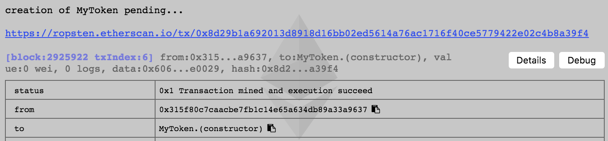

### Audience

This article is aimed for Solidity smart contract developers.

There are plenty of articles explaing what is blockchain, what is Ethereum, how technology is changing the world.

We will not bore you to death, instead we will present fast, easy and approachable way of integrating Wings forecasting features into your ICO contract.


### Why use Wings?

Wings is DAO (decenrtalised autonomous organisation) that curates and evaluates projects, and based on their performance receive service reward payments in the form of ERC20 tokens and Ether.

The main advantages of using Wings DAO are transparency, crowd AI and decentralized curation.

In order to operate in a fully decentralised way, the ICO contract needs to implement certain methods - in this tutorial we show you step by step what has to be done.


### ICO Wings Integration, "technical deep dive"

We will base our code on Wings Integration repository https://github.com/WingsDao/wings-integration

It is also available as `npm` package https://www.npmjs.com/package/wings-integration


#### Inheritance 
The two most important pieces:
* `ICrowdsaleProcessor.sol` - it's the interface, it contains name and signature of the methods that you need to implement, you can find this file [here](https://github.com/WingsDao/wings-integration/blob/master/contracts/interfaces/ICrowdsaleProcessor.sol)
* `BasicCrowdsale.sol` - it's the basic implementation containing some, but not every method required by the `ICrowdsaleProcessor` interface, [here is the file](https://github.com/WingsDao/wings-integration/blob/master/contracts/BasicCrowdsale.sol)


#### ERC20 token
In our example we will use a custom token based on OpenZeppelin implementation. You have probably seen so many implementations of ERC20 standard, here *(for simplicity)* all the fluff is removed. You can use your own token, as long as it is `ERC20` compatible and you properly implement all methods required by `ICrowdsaleProcessor` interface - it is the essence of Wings integration.

```
contract ERC20 {

  using SafeMath for uint256;

  mapping(address => uint256) balances;
  mapping (address => mapping (address => uint256)) internal allowed;
  
  event Transfer(address indexed from, address indexed to, uint256 value);
  event Approval(address indexed owner, address indexed spender, uint256 value);

  uint256 totalSupply_;

  function totalSupply() public view returns (uint256) {
    return totalSupply_;
  }

  function transfer(address _to, uint256 _value) public returns (bool) {
    require(_to != address(0));
    require(_value <= balances[msg.sender]);

    // SafeMath.sub will throw if there is not enough balance.
    balances[msg.sender] = balances[msg.sender].sub(_value);
    balances[_to] = balances[_to].add(_value);
    Transfer(msg.sender, _to, _value);
    return true;
  }

  function balanceOf(address _owner) public view returns (uint256 balance) {
    return balances[_owner];
  }  

  function transferFrom(address _from, address _to, uint256 _value) public returns (bool) {
    require(_to != address(0));
    require(_value <= balances[_from]);
    require(_value <= allowed[_from][msg.sender]);

    balances[_from] = balances[_from].sub(_value);
    balances[_to] = balances[_to].add(_value);
    allowed[_from][msg.sender] = allowed[_from][msg.sender].sub(_value);
    Transfer(_from, _to, _value);
    return true;
  }

  function approve(address _spender, uint256 _value) public returns (bool) {
    allowed[msg.sender][_spender] = _value;
    Approval(msg.sender, _spender, _value);
    return true;
  }

  function allowance(address _owner, address _spender) public view returns (uint256) {
    return allowed[_owner][_spender];
  }
}
```


#### Access modifiers
`Ownable` and `HasManager` are similar to each other. Just like in real life - you could be either a owner of a restaurant or work in a restaurant as a manager.

```
contract Ownable {
  address public owner;

  function Ownable() public {
    owner = msg.sender;
  }

  modifier onlyOwner() {
    require(msg.sender == owner);
    _;
  }

  function transferOwnership(address newOwner) public onlyOwner {
    require(newOwner != address(0));
    owner = newOwner;
  }
}
```

```
contract HasManager {
  address public manager;

  modifier onlyManager {
    require(msg.sender == manager);
    _;
  }

  function transferManager(address _newManager) public onlyManager() {
    require(_newManager != address(0));
    manager = _newManager;
  }
}
```


#### Custom "MyToken"

Based on the ERC20 we create `MyToken` that will be used for the crowdsale. Note that everytime we `mint` it, we increase the total supply. `MyToken` is `Ownable` which means that only owner can mint.

```
contract MyToken is ERC20, Ownable {

  string public name;
  string public symbol;
  uint8 public decimals;
  uint256 public totalSupply;
  bool public releasedForTransfer;


  function MyToken() public {
    name = "MyTokenExample";
    symbol = "MTE";
    decimals = 18;
  }

  // override
  function transfer(address _to, uint256 _value) public returns (bool) {
    require(releasedForTransfer);
    return super.transfer(_to, _value);
  }

  // override 
  function transferFrom(address _from, address _to, uint256 _value) public returns (bool) {
    require(releasedForTransfer);
    return super.transferFrom(_from, _to, _value);
  }

  function release() public onlyOwner() {
    releasedForTransfer = true;
  }
    
  function mint(address _recepient, uint256 _amount) public onlyOwner() {
    require (!releasedForTransfer);
    balances[_recepient] += _amount;
    totalSupply += _amount;
  }
}
```

#### File structure

We can structure files the following way:


*(because Ethereum ecosystem is evolving very rapidly, chances are the view of Remix IDE will change)*

Another option is to keep everything in the single file - up to you. It's just like discussion about `tabs` and `spaces`. My humble 2 satoshis in this discussion - I prefer 

#### Deployment
First we need to deploy the token. For deployment we will use the [Remix IDE](https://remix.ethereum.org/), Metamask (Chrome extenstion) and Ropsten testnet. The biggest advantage of using these tools is that we don't have operate the full node on our machine and deployment is literally one-click process.

If you don't have a Metamask account, you can create one with easy and "buy" test Ether - there is a [faucet](https://faucet.metamask.io/) allowing you to get some test Ether for free. It's very handy and practical when testing your code, you should always deploy to the testnet first (no excuses here).

##### Why not Truffle framework?

Many tutorials are using Truffle framework. It's a very sensible choice, it offers handy framework for testing.

However, it's not immediately obvious which Solidity compiler is being used, see [this question on StackOverflow](https://ethereum.stackexchange.com/questions/3256/how-do-i-find-out-the-solidity-compiler-version-i-am-using) and from my own experience it's easier to use combination of Remix and Metamask.


#### Deploying the token

We cannot deploy everything all at once, we need to deploy `MyToken` contract first. Then, when deploying `MyCrowdsale` we will pass the `MyToken` contract address to the constructor.

Choose the right contract:


Confirm in Metamask:


After few moments *(block confirmation)* you should see:



#### Deploying the crowdsale

`MyCrowdsale` inherits from `BasicCrowdsale` (that implements some methods) and `ICrowdsaleProcessor`... Now we need to implement the remainder:

```
contract MyCrowdsale is BasicCrowdsale {
  mapping(address => uint256) participants;

  uint256 tokensPerEthPrice;
  MyToken crowdsaleToken;

  // Ctor. In this example, minimalGoal, hardCap, and price are not changeable.
  // In more complex cases, those parameters may be changed until start() is called.
  // simplest case where manager==owner. See onlyOwner() and onlyManager() modifiers
  // before functions to figure out the cases in which those addresses should differ
  function MyCrowdsale(uint256 _minimalGoal, uint256 _hardCap, uint256 _tokensPerEthPrice, address _token) public BasicCrowdsale(msg.sender, msg.sender) {
    minimalGoal = _minimalGoal;
    hardCap = _hardCap;
    tokensPerEthPrice = _tokensPerEthPrice;
    crowdsaleToken = MyToken(_token);
  }

  function getToken() public returns(address) {
    return address(crowdsaleToken);
  }

  // called by CrowdsaleController to transfer reward part of
  // tokens sold by successful crowdsale to Forecasting contract.
  // This call is made upon closing successful crowdfunding process.
  function mintTokenRewards(address _contract, uint256 _amount) public onlyManager()  {
    crowdsaleToken.mint(_contract, _amount); // crowdsale token is mintable in this example, tokens are created here
  }

  // transfers crowdsale token from mintable to transferrable state
  function releaseTokens() public onlyManager() hasntStopped() whenCrowdsaleSuccessful() {
    crowdsaleToken.release();
  }

  // DEFAULT FUNCTION - allows for ETH transfers to the contract
  function () payable public {
    require(msg.value > 0);
    sellTokens(msg.sender, msg.value);
  }

  function sellTokens(address _recepient, uint256 _value) internal hasBeenStarted() hasntStopped() whenCrowdsaleAlive() {
    uint256 newTotalCollected = totalCollected + _value;

    if (hardCap < newTotalCollected) {
      // don't sell anything above the hard cap

      uint256 refund = newTotalCollected - hardCap;
      uint256 diff = _value - refund;

      // send the ETH part which exceeds the hard cap back to the buyer
      _recepient.transfer(refund);
      _value = diff;
    }

    // token amount as per price (fixed in this example)
    uint256 tokensSold = _value * tokensPerEthPrice;

    // create new tokens for this buyer
    crowdsaleToken.mint(_recepient, tokensSold);

    // remember the buyer so he/she/it may refund its ETH if crowdsale failed
    participants[_recepient] += _value;

    // update total ETH collected
    totalCollected += _value;

    // update totel tokens sold
    totalSold += tokensSold;
  }

  // project's owner withdraws ETH funds to the funding address upon successful crowdsale
  function withdraw(uint256 _amount) public onlyOwner() hasntStopped() whenCrowdsaleSuccessful() {
    require(_amount <= this.balance);
    fundingAddress.transfer(_amount);
  }

  // backers refund their ETH if the crowdsale was cancelled or has failed
  function refund() public {
    require(stopped || isFailed()); // either cancelled or failed
    uint256 amount = participants[msg.sender];
    require(amount > 0); // prevent from doing it twice
    participants[msg.sender] = 0;
    msg.sender.transfer(amount);
  }
}
```

The constructors accepts the following parameters:
* `uint256 _minimalGoal`
* `uint256 _hardCap`
* `uint256 _tokensPerEthPrice`
* `address _token`

Now you should see the importance of creating `MyToken` contract first.

One thing to keep in mind - Solidity has built-in human readable names such as `ether` or `seconds`, `minutes`, `hours`. You can see more in the docs: http://solidity.readthedocs.io/en/v0.4.21/units-and-global-variables.html

However, when passing `uint256` we will have to use https://etherconverter.online/ for example: `1 ether = 1000000000000000000 wei`


Because the number is too big for JavaScript *(we are using Remix IDE in the browser)* we need to put quotes around the number, see [this StackOverflow question](https://ethereum.stackexchange.com/questions/8041/solidity-browser-compiler-error-assertion-failed).

In my instance the complete constructor parameters look like that:

`"10000000000000000000", "100000000000000000000", 1000, "0xcebaf9eee389fd5589194a04801698be41e4bd78"`

*(it will be different in your case because of the `MyToken` contract address)*

Once we have a proper construction parameters in place, we can deply `MyCrowdsale`. Metamask will ask for confirmation and after the block is mined we can see the transaction on Ethercan.


#### Verification on Etherscan

Once we have token deployed, we can verify source code on Etherscan - that is always the best practice - so that anyone can see the source and verify that we do is right. Note, that **very few people have skill or ability to review the code** and sometimes $150m bugs are left intact for 100+ days. If you don't believe just use your preferred search engine and ask for "parity hack".

Because we separated our code into a few individual files, for Etherscan verification we will simply copy and paste into a single file.

You can find the [whole file here](https://github.com/stefek99/wings-integration/blob/master/tutorial/full-tutorial.sol).


### Summary

We deployed our ICO conract that implements `ICrowdsaleProcessor.sol` and therefore making it compatible with Wings DAO.

### Feedback

This is `0.1` version of this tutorial. If there are any discrepancies, rough edges, areas to improve - go ahead and [open an issue on Github](https://github.com/WingsDao/wings-integration/issues), join our community Telegram chat or contact me directly michal@wings.ai or call me directly `+44 758 629 4279` - I am totally aware how frustrating it is - be stuck on a non-working tutorial and I can make a promise to you that I'll do everything in my ability to make your life easier.


### Great learning resources for beginners

This tutorial assumes some existing Solidity knowledge. If you want to learn basics I highly recommend two great video course explaining everything from scratch.

If you are a beginner to Ethereum, you'll should probably start with much more approachable resources here:
* https://coursetro.com/courses/20/Developing-Ethereum-Smart-Contracts-for-Beginners
* https://www.youtube.com/channel/UCaWes1eWQ9TbzA695gl_PtA